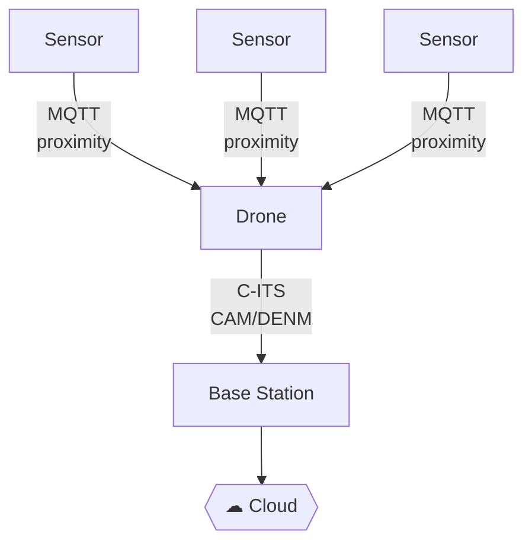
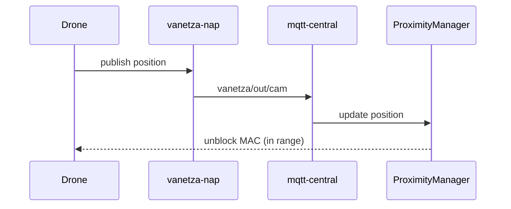
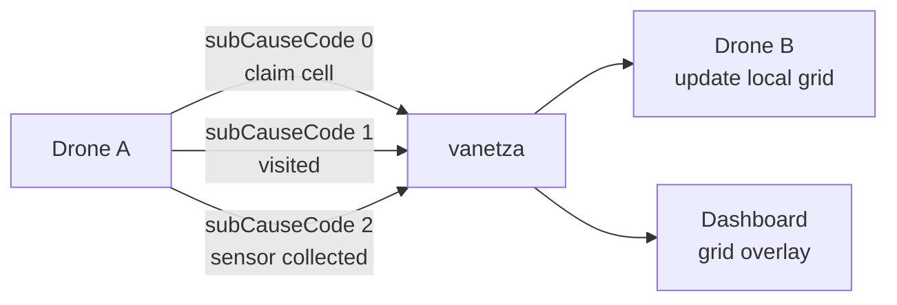
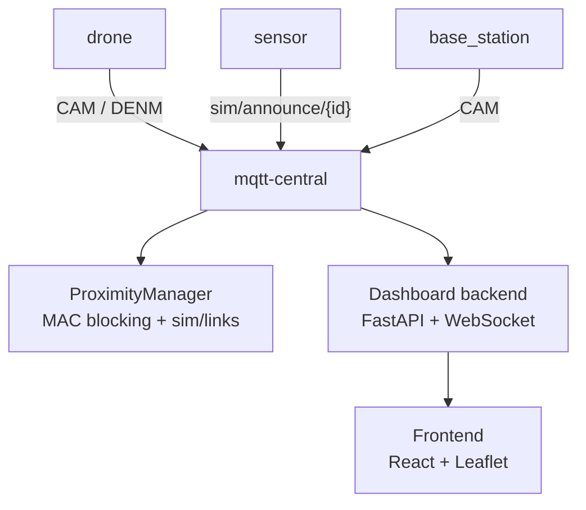

# Motivation

Forest monitoring requires **continuous, large-scale coverage** of remote terrain.

Human inspection is costly, slow, and dangerous.

<!-- pause -->

**Idea:** Deploy autonomous drones that sweep a forest area, detect ground sensors, collect environmental readings, and relay data to a base station — all coordinated via **standardised vehicular communication (ETSI C-ITS)**.

<!-- end_slide -->

# System Overview

<!-- column_layout: [1, 1] -->

<!-- column: 0 -->

- Sensors are **static** — announce position, serve data on request via MQTT
- Drones **sweep** the area, detect sensors via proximity, collect readings
- Drone ↔ Base station communicate via **C-ITS** (CAM/DENM)
- Base station **aggregates** data and uploads to cloud

<!-- column: 1 -->



<!-- end_slide -->

# CAM — Cooperative Awareness Messages

**Purpose:** every entity continuously broadcasts its presence and position.

<!-- pause -->



<!-- pause -->

- Drone detects a **sensor** in range → CAM with `stationType = 20`
- Drone detects **base station** → CAM with `stationType = 15`

<!-- end_slide -->

# DENM — Decentralised Environmental Notification Messages

**Purpose:** drones publish cell events as they sweep the area.

<!-- pause -->



<!-- pause -->

- Peers avoid re-visiting already **claimed/visited** cells
- On first contact between two drones → full **grid sync** (subCauseCode=3)

<!-- end_slide -->

# Architecture



<!-- end_slide -->

# Demo

> **http://localhost:3000**

<!-- pause -->

- Map with base station, sensors, and connectivity links
- Entity panel — station IDs, coordinates, tick counter
- Links appear/disappear as entities move in/out of range

```bash
make up
```

<!-- end_slide -->

# What Is Implemented

- **Network baseline** — vanetza-nap containers exchanging CAMs over a virtual ITS-G5 network
- **ProximityManager** — dynamic MAC blocking/unblocking based on simulated range
- **Sensors** — self-assign identity at startup, announce via `sim/announce/{id}` (retained), serve data on request
- **Drone core** — identity bootstrap, CAM publishing, state machine stub
- **Base station** — announces itself, receives data deliveries
- **Dashboard** — real-time map, entity list, connectivity links via WebSocket

<!-- end_slide -->

# What Is Missing

- **Drone movement** — position is currently static; boustrophedon path not yet implemented
- **Coverage grid** — cell state tracking (UNKNOWN / CLAIMED / VISITED / SENSOR_FOUND)
- **Sensor collection flow** — drone detecting sensor in range and requesting data
- **Multi-drone coordination** — DENM-based grid sync between peers
- **Mission completion** — base station aggregating all data and uploading to cloud
- **Dashboard grid overlay** — rendering cell states on the map

<!-- end_slide -->

# Thank You

```bash
make prepare-env   # copy .env-sample → .env
make up            # start simulation
# open http://localhost:3000
```

<!-- pause -->

**Questions?**
